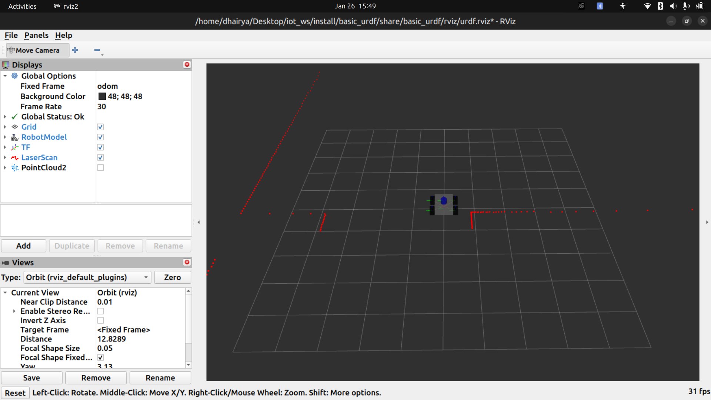
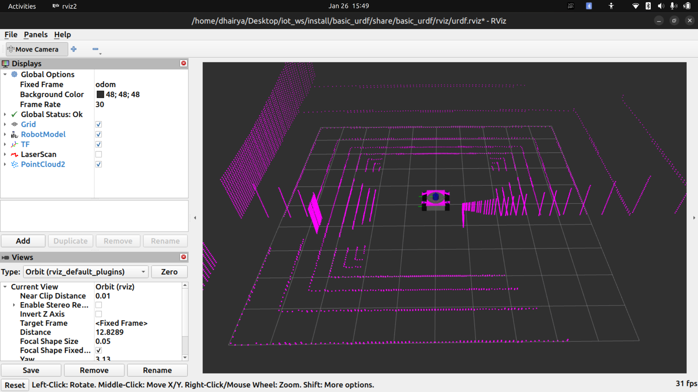

# IOTCLUB 


## Workshop - 1 

### 2D Lidar


### 3D Lidar


### Maze


## How to clone

### Step - 1

```bash
mkdir -p ~/iot_ws/src
```

### Step - 2

```bash
cd ~/iot_ws
git clone https://github.com/dhprlabs/iotclub.git ./src/
```
